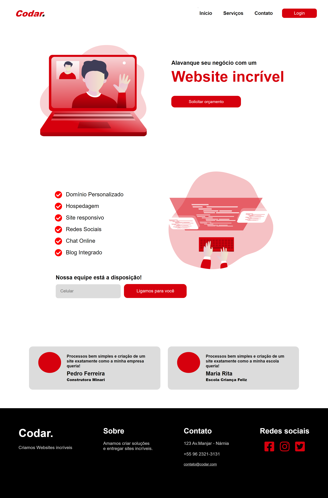

# Amazing-Graph

- Platform challenge [DevChallenge](https://www.devchallenge.com.br/challenges/5ed47992adee277fae224a0b/details) 

# DESKTOP PROJECT

# MOBILE PROJECT
<h1 align="center"> 
     
</h1>

# 🚀 Technologies

#### This project was developed with the following technologies:

- [HTML](https://developer.mozilla.org/pt-BR/docs/Web/HTML)

- [CSS](https://developer.mozilla.org/pt-BR/docs/Web/CSS)

Made with ♥ by Matheus Vieira 👋[Get in touch!](https://www.linkedin.com/in/matheus-silva-vieira/)
